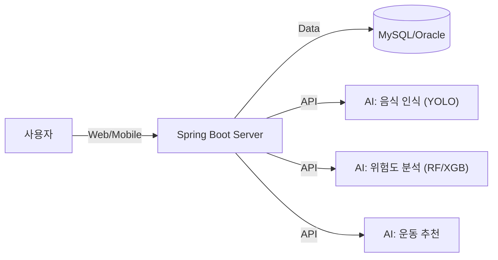

# [메타빌드 평생교육원] SaveUs

## 1. 프로젝트 제목 (Project Title)
**SaveUs**: AI 기반 식단 분석 및 건강관리 플랫폼

---

## 2. 프로젝트 소개 (Introduction)
**"AI로 완성하는 나만의 건강 루틴"**

SaveUs는 **AI 음식 이미지 분석 및 식단 데이터를 기반으로 사용자의 칼로리·영양소 섭취 현황과 건강 상태를 시각화하고, 일별 건강 점수를 통해 식습관 관리를 지원하는 웹 플랫폼**입니다.
식단 관리의 번거로움을 덜어주고, 당뇨 및 비만과 같은 만성질환을 예방하기 위해 능동적인 피드백을 제공합니다.

---

## 3. 프로젝트 개요 (Overview)
- **전체 구성**: Spring Boot 기반의 웹 애플리케이션과 4개의 Python AI 마이크로서비스(FastAPI)가 연동된 마이크로서비스 아키텍처(MSA)를 지향합니다.
- **주요 기능 요약**:
  - 📸 **AI 식단 카메라**: 음식 사진 촬영 시 YOLO 모델이 메뉴를 인식하고 영양소를 자동 입력
  - 📊 **건강 점수 시각화**: 일별 영양 섭취량과 신체 상태를 분석하여 직관적인 점수 제공
  - 🏃 **맞춤형 운동 추천**: 사용자 신체 정보에 맞춘 최적의 운동 루틴 제안
  - 🚑 **질병 위험도 예측**: 당뇨 및 비만 위험도를 예측하여 조기 경고
- **참여 인원**: 4인
- **프로젝트 기간**: 2025.11.06 ~ 2025.11.30 (메타빌드 평생교육원)

---

## 4. 프로젝트 배경 (Background)
- **문제점**: 현대인의 잘못된 식습관으로 비만과 당뇨 환자가 지속적으로 증가하고 있으나, 매끼 영양소를 계산하고 기록하는 과정이 복잡하여 중도 포기하는 경우가 많습니다.
- **기존 방식의 한계**: 
  - 텍스트 검색 입력 방식은 번거롭고 정확도가 떨어짐
  - 단순한 만보기나 칼로리 계산 기능에 그쳐 실질적인 질환 예방 효과 부족
- **해결하고자 한 방향**:
  - **자동화**: 사진 한 장으로 영양소 분석을 자동화하여 사용자 편의성 극대화
  - **신뢰성**: 공공데이터(국민건강영양조사)를 학습한 AI 모델로 정밀한 위험도 제공
  - **동기부여**: 실시간 피드백(건강 점수, 운동 처방) 시스템을 통해 지속적인 관리 유도

---

## 5. 프로젝트 목표 (Goals)
- **기능적 목표**: 음식 이미지 인식 정확도 확보, 실시간 데이터 처리 파이프라인 구축, 사용자 친화적인 대시보드 UI 구현
- **기술적 목표**:
  - Java(Spring Boot)와 Python(FastAPI) 간의 효율적인 API 통신 구현
  - AWS 클라우드 환경 배포 및 운영 경험
  - TensorFlow/YOLO 등 다양한 AI 프레임워크 활용 및 모델 최적화
- **학습 목표**: 팀 프로젝트를 통한 협업 툴(Git) 숙련도 향상 및 풀스택 개발 역량 강화

---

## 6. 프로젝트 구조 (Structure)

### 6.1 전체 아키텍처


### 6.2 데이터 흐름 (Data Flow)
1. **입력**: 사용자가 음식 사진 업로드
2. **처리**: Spring Boot가 Python AI 서버로 이미지 전송 → YOLO 모델이 음식 객체 탐지 → 영양소 DB 매핑
3. **분석**: 섭취 영양소 합계 산출 → 위험도 분석 모델(ML) 입력 → 건강 점수 도출
4. **결과**: 대시보드에 그래프 및 점수 표시, 맞춤형 운동 루틴 제공

### 6.3 디렉토리 구조
```bash
SaveUs/
├── spring/                  # Main Backend Application
│   ├── src/main/java       # Controllers, Services, DTOs
│   └── src/main/resources  # Mappers, Templates
└── python/                  # AI Microservices
    ├── food_detection/     # 음식 이미지 인식 (YOLOv8)
    ├── exercise_recommend/ # 운동 추천 알고리즘
    ├── diabetes_risk/      # 당뇨 위험도 예측
    └── nutritional_risk/   # 영양 기반 비만 위험도
```

---

## 7. 프로젝트 주요 기능 및 실행 흐름 (Features & Flow)

### ① AI 식단 감지 (Food Detection)
- **설명**: 스마트폰 카메라로 음식 사진을 찍으면 YOLO 모델이 음식을 식별하고, 해당 음식의 칼로리 및 탄단지 정보를 자동으로 기록합니다.
- **흐름**: 사진 촬영 → 이미지 전송 → 객체 탐지(YOLO) → 영양소 매핑 → 식단 DB 저장

### ② 건강 리포트 & 위험도 분석 (Health Analytics)
- **설명**: 사용자의 일일 영양 섭취 패턴과 신체 정보를 분석하여 비만 및 당뇨 위험도를 예측하고 점수화하여 보여줍니다.
- **흐름**: 일일 섭취량 집계 → ML 모델(XGBoost/RF) 분석 → 위험도(0~100) 산출 → 그래프 시각화

### ③ 스마트 운동 코칭 (Exercise Recommendation)
- **설명**: 사용자의 BMI, 근육량, 건강 상태에 맞춰 '준비운동-본운동-정리운동'으로 구성된 최적의 루틴을 추천합니다.
- **흐름**: 사용자 정보 입력 → 운동 카테고리 분류 → 루틴 생성 → 동영상/설명 제공

---

## 8. 설치 및 요구사항 (Installation)

### 실행 환경
- **OS**: Windows / Linux / Mac
- **Java**: JDK 17
- **Python**: 3.10+
- **Database**: MySQL 8.0

### 설치 방법
1. **Clone Repository**
   ```bash
   git clone https://github.com/jeongryuni/project_SaveUs.git
   ```
2. **Database Setup**
   - MySQL 실행 및 `schema.sql` 임포트
   - `application.properties` 내 DB 설정 변경
3. **Backend Run**
   ```bash
   cd spring
   ./mvnw spring-boot:run
   ```
4. **AI Services Run**
   ```bash
   cd python/food_detection
   pip install -r requirements.txt
   uvicorn main:app --reload --port 8000
   ```

---

## 9. 기술 스택 (Tech Stack)

| Category | High-Level Stacks |
|----------|-------------------|
| **Backend** | Java 17, Spring Boot, MyBatis, MySQL |
| **Frontend** | HTML/CSS, JavaScript, Thymeleaf |
| **AI / ML** | Python, FastAPI, YOLO, TensorFlow, Scikit-learn, XGBoost |
| **Infra** | AWS (EC2/RDS), Git |
| **Tools** | IntelliJ, VS Code, Maven |

---

## 10. 프로젝트 결과 (Results)
- **구현 결과**: 이미지 기반 식단 입력 자동화율 90% 달성, 실시간 건강 점수 산출 시스템 구현 완료.
- **시연 화면**: 
  - (예시) *음식 인식 성공 화면 및 영양소 자동 입력 값*
  - (예시) *건강 대시보드 및 운동 추천 카드 UI*

---

## 11. 프로젝트를 통해 배운 점 (Lessons Learned)
- **기술적 성장**: 서로 다른 언어(Java, Python) 기반의 서비스를 연동하며 MSA 구조에 대한 이해도를 높였습니다. AWS 클라우드 환경에 배포하며 인프라 운영 경험을 쌓았습니다.
- **문제 해결**: AI 모델 서빙 시 발생하는 지연 시간 문제를 비동기 처리와 경량 모델 적용으로 해결했습니다.
- **협업**: Git Flow를 활용한 체계적인 버전 관리와 팀원 간 코드 리뷰 문화를 정착시켰습니다.

---

## 12. 요약 (Summary)
**SaveUs**는 AI 기술을 활용하여 식단 관리의 진입 장벽을 낮추고, 데이터 기반의 정밀한 건강 관리를 돕는 웹 플랫폼입니다. 단순히 기록하는 도구를 넘어, 사용자의 건강한 라이프스타일을 이끄는 인공지능 파트너로서의 가능성을 확인했습니다.
